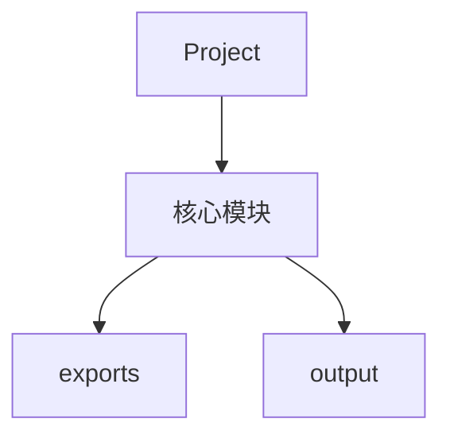

#  软件设计说明书

## 一、软件概述

### 1.1 软件名称

### 1.2 软件版本
V1.0

### 1.3 开发目的
本软件旨在提供[在此描述软件的主要功能和目标]。

## 二、软件架构

### 2.1 整体架构

### 2.2 技术栈
- 编程语言: Python/JavaScript等
- 框架: [列出使用的框架]
- 数据库: [如有]

## 三、功能模块设计

### 3.1 模块划分
根据项目结构分析，本软件包含以下主要模块：

#### 3.1.1 exports模块
**功能描述**: [详细描述该模块的功能]

**主要文件**:

#### 3.1.2 output模块
**功能描述**: [详细描述该模块的功能]

**主要文件**:

## 四、数据处理流程

### 4.1 数据输入
[描述数据输入方式和格式]

### 4.2 处理逻辑
[描述核心处理逻辑]

### 4.3 数据输出
[描述输出结果和格式]

## 五、接口设计

### 5.1 内部接口
[描述模块间的调用关系]

### 5.2 外部接口
[描述与外部系统的交互]

## 六、安全性设计

### 6.1 数据安全
[描述数据保护措施]

### 6.2 访问控制
[描述权限管理机制]

## 七、性能优化

### 7.1 缓存策略
[描述缓存机制]

### 7.2 并发处理
[描述并发处理能力]

## 八、部署方案

### 8.1 运行环境
- 操作系统: Windows/Linux/macOS
- Python版本: 3.8+
- 依赖包: 见requirements.txt

### 8.2 部署步骤
1. 安装依赖: `pip install -r requirements.txt`
2. 配置环境变量
3. 启动服务

---

**文档生成时间**: 2026年4月29日
**生成工具**: Copyright Docs Skill v1.0
