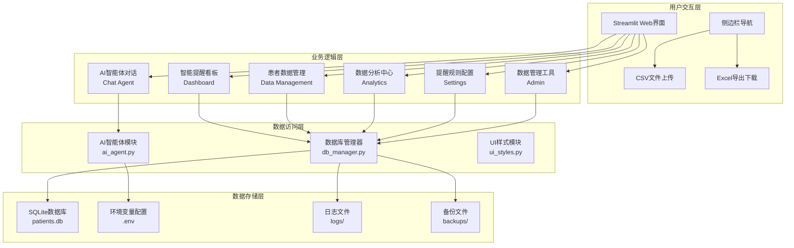
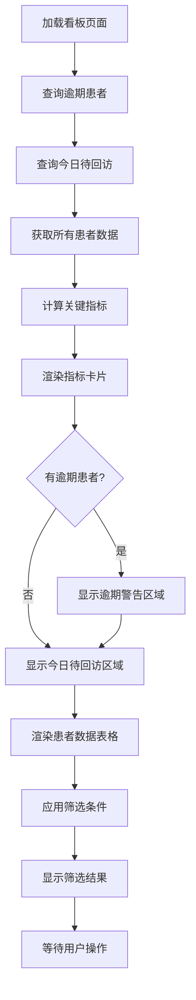
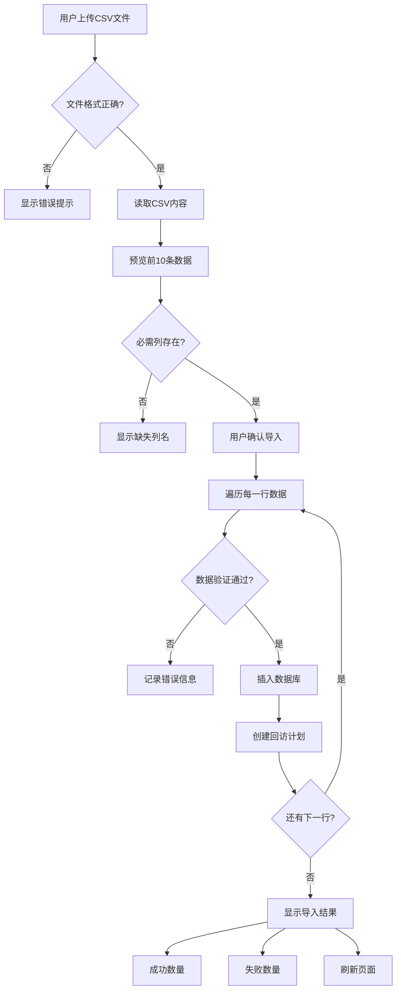
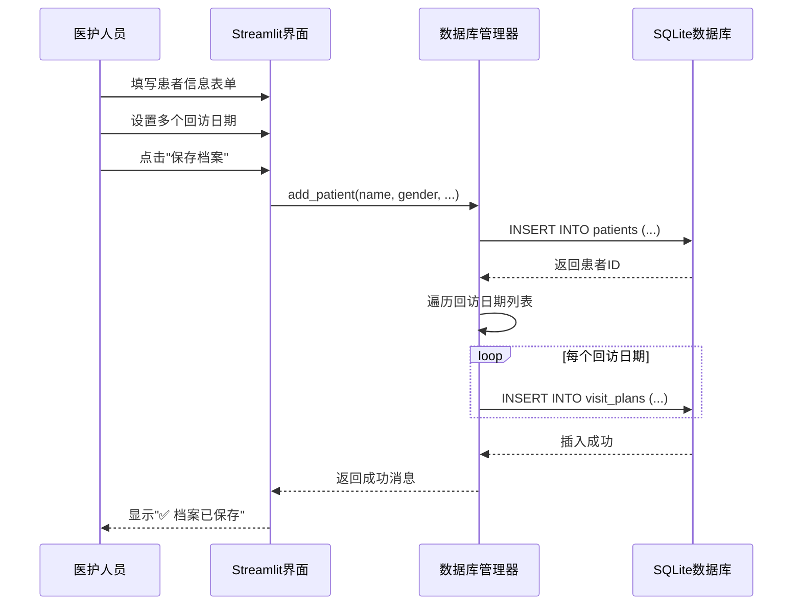
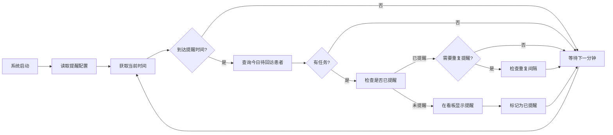

# 患者出院回访智能提醒系统 - 软件设计说明书

## 1. 软件概述

### 1.1 软件名称
**患者出院回访智能提醒系统（Patient Discharge Follow-up Intelligent Reminder System）**

### 1.2 版本号
V1.0.0

### 1.3 开发完成日期
2026年5月

### 1.4 软件简介

患者出院回访智能提醒系统是一套基于人工智能的医疗随访管理平台，深度融合了Streamlit Web框架、LangChain智能体架构、通义千问大语言模型和SQLite数据库技术。系统采用模块化设计理念，通过AI驱动的智能话术生成、多回访日期管理、逾期预警机制和数据分析看板等功能，为医疗机构提供全流程的患者出院随访解决方案。

本系统主要面向医院护理部、随访中心和临床科室，提供以下核心价值：

- **智能提醒看板**：自动识别今日/明日回访任务，紧急任务红色警告，逾期患者优先展示
- **AI话术生成**：基于通义千问自动生成个性化回访话术，针对不同病种提供专业建议
- **多回访日期管理**：支持为单个患者设置多个回访时间点（如出院后7天、30天、90天）
- **患者档案管理**：完整的患者信息录入、查询、状态管理和CSV批量导入功能
- **智能体对话**：与AI助手实时对话，获取回访技巧、疾病护理知识和健康管理建议
- **数据分析仪表盘**：多维度统计分析，包括完成率、病种分布、月度趋势和逾期分析
- **重复数据合并**：基于住院号自动检测并合并重复患者记录，保证数据质量
- **提醒规则自定义**：灵活配置提前提醒天数、每日提醒时间和重复提醒间隔

### 1.5 运行环境

#### 硬件要求
- CPU：Intel Core i3或同等性能以上
- 内存：4GB RAM（推荐8GB）
- 硬盘：至少1GB可用空间
- 网络：需要访问通义千问API

#### 软件要求
- 操作系统：Windows 10/11（推荐）、Linux、macOS
- Python版本：3.8 - 3.12
- 浏览器：Chrome、Edge、Firefox等现代浏览器

#### 依赖服务
- 阿里云通义千问API（Qwen-Turbo模型）
- SQLite数据库（内置，无需额外安装）

---

## 2. 软件架构

### 2.1 总体架构设计

系统采用分层架构设计，从上至下分为用户交互层、业务逻辑层、数据访问层和数据存储层四个层次，各层之间通过标准化接口进行通信。



### 2.2 核心技术栈

| 技术组件 | 版本 | 用途说明 |
|---------|------|---------|
| Streamlit | 1.57.0 | Web前端框架，快速构建交互式界面 |
| LangChain | 1.2.18 | AI智能体编排框架 |
| 通义千问 | qwen-turbo | 大语言模型（话术生成、智能对话） |
| SQLite3 | 3.x | 轻量级关系型数据库 |
| Pandas | 2.3.3 | 数据处理和分析 |
| Python-dotenv | 1.2.2 | 环境变量管理 |
| OpenPyXL | 3.1.5 | Excel文件读写 |
| Pydantic | 2.13.4 | 数据验证和序列化 |

### 2.3 模块划分

系统划分为以下核心模块：

1. **主应用模块**（app.py）：Streamlit页面路由、UI渲染、用户交互处理
2. **数据库管理模块**（db_manager.py）：患者数据CRUD、回访计划管理、提醒配置
3. **AI智能体模块**（ai_agent.py）：话术生成、智能对话、风险评估、案例学习
4. **UI样式模块**（ui_styles.py）：医疗SaaS风格CSS、图标系统、动画效果
5. **配置管理模块**（.env）：API密钥、数据库路径、服务器配置

---

## 3. 功能模块设计

### 3.1 智能提醒看板模块（Dashboard）

#### 3.1.1 模块职责
- 实时显示今日待回访患者列表
- 突出展示逾期患者（红色警告）
- 计算并展示关键指标（总患者数、完成率、逾期率）
- 提供快捷操作（标记完成、推迟回访、生成话术）
- 高级筛选和搜索功能

#### 3.1.2 核心功能实现

```python
# app.py - 智能提醒看板
def render_dashboard():
    """渲染智能提醒看板"""
    # 1. 获取逾期患者
    overdue_patients = db_manager.get_overdue_patients()
    
    # 2. 获取今日待回访患者
    due_patients = db_manager.get_due_patients()
    
    # 3. 计算关键指标
    total_patients = len(all_patients)
    completed_patients = len(df_all[df_all['status'] == 'completed'])
    completion_rate = (completed_patients / total_patients * 100)
    
    # 4. 渲染指标卡片
    st.markdown(ui_styles.get_metric_card_html(
        icon="📞",
        value=len(due_patients),
        label="今日待回访",
        trend="需要立即处理" if len(due_patients) > 0 else "暂无任务",
        card_type="warning"
    ))
    
    # 5. 渲染患者列表和操作按钮
    for patient in due_patients:
        render_patient_card(patient)
        if st.button("✅ 完成", key=f"complete_{patient['id']}"):
            db_manager.update_visit_plan_status(patient['plan_id'], 'completed')
            st.rerun()
```

#### 3.1.3 工作流程



### 3.2 患者数据管理模块

#### 3.2.1 模块职责
- 患者基本信息录入（姓名、性别、住院号、诊断等）
- 多回访日期设置和管理
- CSV批量导入和模板下载
- 数据分页显示和高级筛选
- 回访记录添加和管理
- Excel档案导出

#### 3.2.2 核心数据结构

```python
# 患者表结构（patients）
CREATE TABLE patients (
    id INTEGER PRIMARY KEY AUTOINCREMENT,
    name TEXT NOT NULL,              -- 患者姓名
    gender TEXT,                     -- 性别
    hospital_number TEXT,            -- 住院号（唯一标识）
    discharge_date DATE,             -- 出院日期
    diagnosis TEXT,                  -- 出院诊断
    contact_person TEXT,             -- 联系人
    contact_phone TEXT,              -- 联系电话
    status TEXT DEFAULT 'pending',   -- 状态（pending/completed）
    created_at TIMESTAMP             -- 创建时间
)

# 回访计划表结构（visit_plans）
CREATE TABLE visit_plans (
    id INTEGER PRIMARY KEY AUTOINCREMENT,
    patient_id INTEGER NOT NULL,     -- 患者ID（外键）
    visit_date DATE NOT NULL,        -- 回访日期
    visit_type TEXT DEFAULT '常规回访', -- 回访类型
    status TEXT DEFAULT 'pending',   -- 状态
    notes TEXT,                      -- 备注
    completed_at TIMESTAMP,          -- 完成时间
    created_at TIMESTAMP,            -- 创建时间
    FOREIGN KEY (patient_id) REFERENCES patients(id) ON DELETE CASCADE
)

# 回访记录表结构（visit_records）
CREATE TABLE visit_records (
    id INTEGER PRIMARY KEY AUTOINCREMENT,
    plan_id INTEGER NOT NULL,        -- 回访计划ID
    patient_id INTEGER NOT NULL,     -- 患者ID
    visit_date DATE NOT NULL,        -- 回访日期
    record_content TEXT,             -- 回访内容
    patient_feedback TEXT,           -- 患者反馈
    health_status TEXT,              -- 健康状况
    medication_info TEXT,            -- 用药情况
    next_visit_date DATE,            -- 下次回访日期
    recorder TEXT,                   -- 记录人
    created_at TIMESTAMP,            -- 创建时间
    FOREIGN KEY (plan_id) REFERENCES visit_plans(id) ON DELETE CASCADE,
    FOREIGN KEY (patient_id) REFERENCES patients(id) ON DELETE CASCADE
)
```

#### 3.2.3 CSV导入流程



### 3.3 AI智能体模块（ai_agent.py）

#### 3.3.1 模块职责
- 基于病种生成个性化回访话术
- 提供智能对话服务（回访技巧、疾病知识）
- 根据患者反馈优化话术
- 预测复发风险和评估康复状况
- 推荐个性化回访频率
- 学习优秀案例并提取经验

#### 3.3.2 核心函数设计

```python
def generate_visit_script(patient_name, diagnosis, urgency):
    """
    利用通义千问生成针对性的回访话术
    
    Args:
        patient_name: 患者姓名
        diagnosis: 诊断
        urgency: 紧急程度（今日紧急/逾期X天）
    
    Returns:
        生成的回访话术文本
    """
    llm = ChatTongyi(model_name="qwen-turbo", temperature=0.7)
    
    # 根据诊断类型获取针对性指导
    diagnosis_guidance = _get_diagnosis_guidance(diagnosis)
    
    prompt_template = """
    你是一位经验丰富的专业护士，擅长与患者进行高情商的沟通。
    
    患者信息：
    - 姓名：{name}
    - 诊断：{diagnosis}
    - 状态：{urgency}
    
    该疾病的重点回访内容：
    {guidance}

    任务：
    请根据上述信息，为医生生成一段温馨、专业的回访开场白。
    要求：
    1. 语气要亲切自然，体现人文关怀。
    2. 针对该疾病给出具体的健康建议和注意事项。
    3. 询问患者的恢复情况和是否有不适症状。
    4. 长度控制在 80-120 字之间。
    5. 如果是逾期回访，要表达歉意并说明来意。
    """
    
    prompt = ChatPromptTemplate.from_template(prompt_template)
    chain = prompt | llm
    
    response = chain.invoke({
        "name": patient_name,
        "diagnosis": diagnosis,
        "urgency": urgency,
        "guidance": diagnosis_guidance
    })
    
    return response.content
```

#### 3.3.3 病种知识库

系统内置了常见疾病的回访指导知识库：

| 疾病类别 | 关键词 | 回访重点 |
|---------|--------|---------|
| 胃癌术后 | 胃、癌、肿瘤 | 饮食情况、消化功能、体重变化、伤口恢复 |
| 肝癌术后 | 肝、癌、肿瘤 | 肝功能指标、饮食禁忌、休息情况、腹部症状 |
| 肺癌术后 | 肺、癌、肿瘤 | 呼吸状况、活动能力、戒烟情况、胸部症状 |
| 心血管疾病 | 心脏、高血压、冠心病 | 血压监测、用药依从、症状观察、生活方式 |
| 糖尿病 | 糖尿病、血糖 | 血糖控制、饮食管理、用药情况、足部护理 |
| 骨科疾病 | 骨折、关节、脊柱 | 疼痛评估、活动能力、康复训练、伤口情况 |

### 3.4 数据分析中心模块

#### 3.4.1 模块职责
- 多维度数据统计（总患者数、完成率、逾期率）
- 回访趋势分析（按日/周/月统计）
- 病种分布可视化
- 逾期情况分析（逾期天数分布）
- 月度回访统计报表

#### 3.4.2 核心指标计算

```python
# 计算完成率
total_patients = len(df_all)
completed_patients = len(df_all[df_all['status'] == 'completed'])
completion_rate = (completed_patients / total_patients * 100) if total_patients > 0 else 0

# 计算逾期率
overdue_patients = db_manager.get_overdue_patients()
overdue_count = len(overdue_patients)
overdue_rate = (overdue_count / total_patients * 100) if total_patients > 0 else 0

# 月度统计
df_all['created_month'] = pd.to_datetime(df_all['created_at']).dt.to_period('M')
monthly_stats = df_all.groupby('created_month').agg({
    'id': 'count',
    'status': lambda x: (x == 'completed').sum()
}).rename(columns={'id': '总患者数', 'status': '完成数'})

monthly_stats['完成率'] = (monthly_stats['完成数'] / monthly_stats['总患者数'] * 100).round(1)
```

### 3.5 提醒规则配置模块

#### 3.5.1 模块职责
- 配置提前提醒天数（0-30天）
- 设置每日固定提醒时间
- 启用/禁用重复提醒
- 配置重复提醒间隔（6/12/24/48/72小时）
- 实时预览配置效果

#### 3.5.2 配置表结构

```sql
CREATE TABLE reminder_settings (
    id INTEGER PRIMARY KEY AUTOINCREMENT,
    setting_key TEXT UNIQUE NOT NULL,    -- 配置键
    setting_value TEXT NOT NULL,         -- 配置值
    description TEXT,                    -- 描述
    updated_at TIMESTAMP                 -- 更新时间
)

-- 默认配置
INSERT INTO reminder_settings VALUES 
    ('advance_days', '0', '提前N天提醒'),
    ('reminder_time', '09:00', '每天固定提醒时间'),
    ('repeat_interval', '24', '重复提醒间隔（小时）'),
    ('enable_advance_reminder', 'false', '是否启用提前提醒'),
    ('enable_repeat_reminder', 'true', '是否启用重复提醒');
```

### 3.6 数据管理工具模块

#### 3.6.1 模块职责
- 查找重复患者记录（基于住院号）
- 合并重复记录（迁移回访计划、删除冗余数据）
- 数据库统计信息展示
- 数据备份提示

#### 3.6.2 重复数据合并算法

```python
def merge_duplicate_patients(hospital_number, keep_patient_id):
    """
    合并具有相同住院号的重复患者记录
    
    Args:
        hospital_number: 住院号
        keep_patient_id: 要保留的患者ID（主记录）
    
    Returns:
        (merged_count, deleted_count, message)
    """
    # 1. 获取该住院号下的所有患者
    all_patient_ids = query_patients_by_hospital_number(hospital_number)
    
    # 2. 找出需要合并的患者（除了保留的那个）
    merge_patient_ids = [pid for pid in all_patient_ids if pid != keep_patient_id]
    
    # 3. 对于每个需要合并的患者
    for old_patient_id in merge_patient_ids:
        # 3.1 迁移回访计划到保留的患者
        UPDATE visit_plans SET patient_id = keep_patient_id 
        WHERE patient_id = old_patient_id
        
        # 3.2 删除旧的患者记录
        DELETE FROM patients WHERE id = old_patient_id
    
    # 4. 提交事务
    conn.commit()
```

---

## 4. 数据处理流程

### 4.1 患者登记完整流程



### 4.2 AI话术生成流程

```mermaid
flowchart TD
    Start[用户点击"生成话术"] --> GetPatient[获取患者信息]
    GetPatient --> GetDiagnosis[提取诊断信息]
    GetDiagnosis --> MatchGuidance{匹配病种知识库}
    MatchGuidance -->|找到| UseGuidance[使用针对性指导]
    MatchGuidance -->|未找到| UseDefault[使用通用指导]
    UseGuidance --> BuildPrompt[构建提示词模板]
    UseDefault --> BuildPrompt
    BuildPrompt --> CallLLM[调用通义千问API]
    CallLLM --> ReceiveResponse[接收AI响应]
    ReceiveResponse --> DisplayScript[显示话术内容]
    DisplayScript --> End[用户复制或直接使用]
```

### 4.3 回访任务提醒流程



### 4.4 数据导出流程

```mermaid
flowchart TD
    Start[用户选择患者] --> ClickExport[点击"导出Excel档案"]
    ClickExport --> GetProfile[获取患者完整档案]
    GetProfile --> CreateWorkbook[创建Excel工作簿]
    CreateWorkbook --> Sheet1[Sheet1: 患者基本信息]
    Sheet1 --> Sheet2[Sheet2: 回访计划]
    Sheet2 --> Sheet3[Sheet3: 回访记录]
    Sheet3 --> ApplyStyle[应用样式和格式]
    ApplyStyle --> SaveFile[保存到exports目录]
    SaveFile --> ProvideDownload[提供下载按钮]
    ProvideDownload --> End[用户下载文件]
```

---

## 5. 接口设计

### 5.1 内部接口

#### 5.1.1 数据库管理接口

```python
# db_manager.py

def init_db():
    """初始化数据库，创建所有必需的表"""
    pass

def add_patient(name, gender, discharge_date, visit_dates, 
                diagnosis, contact_person, contact_phone, 
                hospital_number=None):
    """
    添加新患者及其回访计划
    
    Args:
        name: 患者姓名
        gender: 性别
        discharge_date: 出院日期
        visit_dates: 回访日期列表，例如 ['2026-05-10', '2026-06-10']
        diagnosis: 出院诊断
        contact_person: 联系人
        contact_phone: 联系电话
        hospital_number: 住院号（可选）
    """
    pass

def get_due_patients():
    """
    查询今天需要回访的患者
    
    Returns:
        list: 患者列表，每个元素包含姓名、诊断、回访日期等信息
    """
    pass

def get_overdue_patients():
    """
    查询已过回访日期但状态仍为pending的患者
    
    Returns:
        list: 逾期患者列表，包含逾期天数
    """
    pass

def update_visit_plan_status(plan_id, status):
    """
    更新单个回访计划的状态
    
    Args:
        plan_id: 回访计划ID
        status: 新状态（'pending' 或 'completed'）
    """
    pass

def import_patients_from_csv(csv_data):
    """
    从CSV数据批量导入患者
    
    Args:
        csv_data: list of dicts，每个dict包含患者信息
    
    Returns:
        tuple: (success_count, error_count, errors_list)
    """
    pass

def export_patient_to_excel(patient_id, output_path):
    """
    导出患者档案到Excel文件
    
    Args:
        patient_id: 患者ID
        output_path: 输出文件路径
    
    Returns:
        tuple: (success, message)
    """
    pass
```

#### 5.1.2 AI智能体接口

```python
# ai_agent.py

def generate_visit_script(patient_name, diagnosis, urgency):
    """
    生成个性化回访话术
    
    Args:
        patient_name: 患者姓名
        diagnosis: 诊断
        urgency: 紧急程度描述
    
    Returns:
        str: 生成的话术文本
    """
    pass

def chat_with_agent(message, history=None):
    """
    与智能体进行对话
    
    Args:
        message: 用户消息
        history: 对话历史（可选）
    
    Returns:
        str: AI回复
    """
    pass

def optimize_visit_script(patient_name, diagnosis, 
                          previous_feedback, original_script=''):
    """
    根据患者反馈优化回访话术
    
    Args:
        patient_name: 患者姓名
        diagnosis: 诊断
        previous_feedback: 之前的患者反馈
        original_script: 原始话术（可选）
    
    Returns:
        str: 优化后的话术
    """
    pass

def predict_recurrence_risk(diagnosis, patient_history, visit_records):
    """
    基于历史数据预测复发风险
    
    Args:
        diagnosis: 诊断
        patient_history: 患者历史信息（字典）
        visit_records: 回访记录列表
    
    Returns:
        dict: 风险评估结果（包含风险等级、评分、建议措施）
    """
    pass
```

### 5.2 外部接口

#### 5.2.1 阿里云DashScope API

**接口地址**：`https://dashscope.aliyuncs.com/compatible-mode/v1/chat/completions`

**请求示例**：
```python
from langchain_community.chat_models import ChatTongyi

llm = ChatTongyi(
    model_name="qwen-turbo",
    temperature=0.7
)

messages = [
    {"role": "system", "content": "你是一位专业的医疗助手"},
    {"role": "user", "content": "如何回访胃癌术后患者？"}
]

response = llm.invoke(messages)
print(response.content)
```

**响应格式**：
```json
{
  "choices": [
    {
      "message": {
        "role": "assistant",
        "content": "回访胃癌术后患者时，应重点关注饮食情况..."
      }
    }
  ]
}
```

### 5.3 数据交换格式

#### 5.3.1 患者数据格式（JSON）

```json
{
  "id": 1,
  "name": "张三",
  "gender": "男",
  "hospital_number": "202605051705",
  "discharge_date": "2026-05-05",
  "diagnosis": "胃癌术后",
  "contact_person": "张家属",
  "contact_phone": "13800138001",
  "status": "pending",
  "created_at": "2026-05-09 10:30:00",
  "visit_plans": [
    {
      "plan_id": 1,
      "visit_date": "2026-05-12",
      "visit_type": "常规回访",
      "status": "pending",
      "completed_at": null
    },
    {
      "plan_id": 2,
      "visit_date": "2026-06-05",
      "visit_type": "常规回访",
      "status": "pending",
      "completed_at": null
    }
  ]
}
```

#### 5.3.2 CSV导入模板格式

```csv
姓名,性别,住院号,出院日期,回访日期,诊断,联系人,联系电话,状态
张三,男,202605051705,2026-05-05,2026-05-12,胃癌术后,张家属,13800138001,pending
李四,女,202605061234,2026-05-06,2026-05-13,糖尿病,李家属,13800138002,pending
```

---

## 6. 安全性设计

### 6.1 API密钥管理

#### 6.1.1 环境变量隔离
- 所有敏感信息（API密钥）存储在`.env`文件中
- `.env`文件已加入`.gitignore`，不会提交到版本控制系统
- 提供`.env.example`作为配置模板

```python
# .env
DASHSCOPE_API_KEY=your_api_key_here
DASHSCOPE_MODEL=qwen-turbo

# app.py
from dotenv import load_dotenv
load_dotenv()

api_key = os.getenv("DASHSCOPE_API_KEY")
if not api_key:
    st.error("请配置DASHSCOPE_API_KEY环境变量")
    st.stop()
```

#### 6.1.2 密钥安全提示
- 不要将`.env`文件上传到公开仓库
- 定期更换API密钥
- 限制API调用配额

### 6.2 输入验证

#### 6.2.1 必填字段验证
```python
# app.py - 患者登记表单
if submitted:
    if name and diagnosis and contact_person and contact_phone:
        # 验证通过，保存数据
        db_manager.add_patient(...)
    else:
        st.error("请填写完整信息")
```

#### 6.2.2 CSV数据验证
```python
# db_manager.py
def import_patients_from_csv(csv_data):
    for i, row in enumerate(csv_data, 1):
        # 验证必填字段
        required_fields = ['姓名', '性别', '出院日期', '回访日期', 
                          '诊断', '联系人', '联系电话']
        missing = [f for f in required_fields if not row.get(f)]
        
        if missing:
            error_count += 1
            errors.append(f"第{i}行：缺少必填字段 {missing}")
            continue
        
        # 数据验证通过后插入数据库
        ...
```

### 6.3 错误处理

#### 6.3.1 异常捕获策略
```python
# app.py - 数据加载
try:
    all_patients = db_manager.get_all_patients()
except Exception as e:
    st.markdown(f'''
    <div class="alert alert-error">
        <strong>⚠️ 数据加载失败</strong>
        <p>无法获取患者数据：{str(e)}</p>
        <button class="btn btn-secondary" onclick="location.reload()">
            🔄 重试
        </button>
    </div>
    ''', unsafe_allow_html=True)
    st.stop()
```

#### 6.3.2 日志记录
- 记录关键操作（数据导入、状态更新）
- 不记录敏感信息（患者电话、API密钥）
- 日志文件定期归档和清理

### 6.4 数据隐私保护

#### 6.4.1 本地数据存储
- 所有患者数据存储在本地SQLite数据库
- 不上传患者身份信息到云端（除AI话术生成时的临时调用）
- 支持数据备份和恢复

#### 6.4.2 数据备份机制
```bash
# backup.bat - 自动备份脚本
@echo off
set BACKUP_DIR=D:\remindercode\backups
set TIMESTAMP=%date:~0,4%%date:~5,2%%date:~8,2%_%time:~0,2%%time:~3,2%%time:~6,2%
copy patients.db "%BACKUP_DIR%\patients_backup_%TIMESTAMP%.db"
echo 备份完成: patients_backup_%TIMESTAMP%.db
```

---

## 7. 性能优化

### 7.1 数据库优化

#### 7.1.1 索引设计
```sql
-- 为患者表的常用查询字段创建索引
CREATE INDEX idx_patients_status ON patients(status);
CREATE INDEX idx_patients_created_at ON patients(created_at);
CREATE INDEX idx_patients_hospital_number ON patients(hospital_number);

-- 为回访计划表创建索引
CREATE INDEX idx_visit_plans_patient_id ON visit_plans(patient_id);
CREATE INDEX idx_visit_plans_visit_date ON visit_plans(visit_date);
CREATE INDEX idx_visit_plans_status ON visit_plans(status);
```

#### 7.1.2 查询优化
```python
# 使用参数化查询防止SQL注入
cursor.execute('''
    SELECT p.name, p.diagnosis, vp.visit_date
    FROM visit_plans vp
    JOIN patients p ON vp.patient_id = p.id
    WHERE vp.visit_date = ? AND vp.status != 'completed'
''', (today,))
```

### 7.2 前端性能优化

#### 7.2.1 骨架屏加载
```python
# 显示加载状态指示器
loading_placeholder = st.empty()
with loading_placeholder:
    st.markdown('''
    <div style="padding: 2rem;">
        <div class="skeleton skeleton-title" style="width: 40%;"></div>
        <div class="skeleton skeleton-text" style="width: 60%;"></div>
    </div>
    ''', unsafe_allow_html=True)

# 数据加载完成后清除骨架屏
loading_placeholder.empty()
```

#### 7.2.2 数据分页
```python
# 每页显示20条记录
items_per_page = 20
total_pages = max(1, (total_items + items_per_page - 1) // items_per_page)

# 计算当前页的数据范围
start_idx = (current_page - 1) * items_per_page
end_idx = min(start_idx + items_per_page, total_items)
page_df = filtered_df.iloc[start_idx:end_idx]
```

### 7.3 AI调用优化

#### 7.3.1 缓存机制
```python
# 使用Session State缓存AI生成的话术
script_state_key = f"script_data_{patient['id']}"
if script_state_key not in st.session_state:
    with st.spinner("AI 正在生成..."):
        script = ai_agent.generate_visit_script(...)
        st.session_state[script_state_key] = script
else:
    script = st.session_state[script_state_key]
```

#### 7.3.2 异步处理
```python
# 在后台线程中执行耗时操作
import threading

def async_generate_script(patient_id):
    script = ai_agent.generate_visit_script(...)
    st.session_state[f"script_{patient_id}"] = script

thread = threading.Thread(target=async_generate_script, args=(patient_id,))
thread.start()
```

---

## 8. 部署方案

### 8.1 部署环境要求

#### 8.1.1 硬件配置
- CPU：Intel Core i3或同等性能以上
- 内存：4GB RAM（推荐8GB）
- 硬盘：至少1GB可用空间
- 网络：稳定的互联网连接（访问通义千问API）

#### 8.1.2 软件环境
- 操作系统：Windows 10/11（推荐）、Linux、macOS
- Python版本：3.8 - 3.12
- 浏览器：Chrome 90+、Edge 90+、Firefox 88+

### 8.2 部署步骤

#### 8.2.1 一键部署（Windows）

```batch
:: deploy.bat
@echo off
echo ========================================
echo 患者出院回访智能提醒系统 - 部署脚本
echo ========================================

:: 1. 检查Python是否安装
python --version >nul 2>&1
if errorlevel 1 (
    echo ❌ 未检测到Python，请先安装Python 3.8+
    pause
    exit /b 1
)

:: 2. 创建虚拟环境
echo 📦 创建虚拟环境...
python -m venv .venv
call .venv\Scripts\activate

:: 3. 安装依赖
echo 📥 安装依赖包...
pip install -r requirements.txt

:: 4. 配置环境变量
if not exist .env (
    echo ⚙️ 创建环境配置文件...
    copy .env.example .env
    echo 请编辑 .env 文件，填入通义千问API密钥
)

:: 5. 初始化数据库
echo 🗄️ 初始化数据库...
python -c "import db_manager; db_manager.init_db()"

:: 6. 创建必要目录
echo 📁 创建必要目录...
mkdir logs 2>nul
mkdir backups 2>nul
mkdir exports 2>nul

echo ✅ 部署完成！
echo.
echo 下一步：
echo 1. 编辑 .env 文件，配置API密钥
echo 2. 运行 start_production.bat 启动系统
echo 3. 浏览器访问 http://localhost:8501
pause
```

#### 8.2.2 生产模式启动

```batch
:: start_production.bat
@echo off
echo ========================================
echo 启动患者出院回访智能提醒系统
echo ========================================

:: 激活虚拟环境
call .venv\Scripts\activate

:: 设置Streamlit配置
set STREAMLIT_SERVER_PORT=8501
set STREAMLIT_SERVER_ADDRESS=0.0.0.0
set STREAMLIT_SERVER_HEADLESS=true

:: 启动应用
echo 🚀 启动服务...
streamlit run app.py --server.port=8501 --server.headless=true

pause
```

### 8.3 开机自启动配置

#### 8.3.1 创建Windows任务计划

```batch
:: install_autostart.bat
@echo off
echo 配置开机自启动...

:: 创建任务计划
schtasks /create /tn "PatientFollowUpSystem" ^
    /tr "D:\remindercode\auto_start.bat" ^
    /sc onlogon ^
    /rl highest ^
    /ru "%USERNAME%"

echo ✅ 开机自启动配置完成
echo 系统将在下次登录时自动启动
pause
```

#### 8.3.2 自动启动脚本

```batch
:: auto_start.bat
@echo off
cd /d D:\remindercode
call .venv\Scripts\activate
start streamlit run app.py --server.port=8501 --server.headless=true
```

### 8.4 数据备份策略

#### 8.4.1 手动备份

```batch
:: backup.bat
@echo off
set BACKUP_DIR=D:\remindercode\backups
set TIMESTAMP=%date:~0,4%%date:~5,2%%date:~8,2%_%time:~0,2%%time:~3,2%%time:~6,2%

echo 正在备份数据库...
copy patients.db "%BACKUP_DIR%\patients_backup_%TIMESTAMP%.db"

echo ✅ 备份完成: patients_backup_%TIMESTAMP%.db
pause
```

#### 8.4.2 自动备份（Windows任务计划）

```batch
:: 每天凌晨2点自动备份
schtasks /create /tn "DailyBackup" ^
    /tr "D:\remindercode\backup.bat" ^
    /sc daily ^
    /st 02:00 ^
    /ru "%USERNAME%"
```

### 8.5 故障排查

#### 8.5.1 常见问题及解决方案

| 问题 | 可能原因 | 解决方案 |
|-----|---------|---------|
| 无法启动服务 | Python未安装或版本不匹配 | 安装Python 3.8+，检查PATH环境变量 |
| 依赖安装失败 | 网络连接问题 | 使用国内镜像源：`pip install -i https://pypi.tuna.tsinghua.edu.cn/simple -r requirements.txt` |
| API调用失败 | API密钥未配置或无效 | 检查.env文件中的DASHSCOPE_API_KEY |
| 数据库锁定 | 多个进程同时访问 | 关闭其他实例，重启服务 |
| 端口被占用 | 8501端口已被其他程序使用 | 修改STREAMLIT_SERVER_PORT或关闭占用程序 |

#### 8.5.2 日志查看

```python
# 查看应用日志
tail -f logs/app.log

# 检查数据库状态
python check_db_status.py
```

### 8.6 系统维护

#### 8.6.1 定期维护任务
1. **每周**：检查数据库文件大小，清理过期备份
2. **每月**：导出完整数据备份，验证备份完整性
3. **每季度**：更新依赖包版本，检查安全漏洞
4. **每年**：评估系统性能，优化数据库索引

#### 8.6.2 数据清理

```python
# 清理已完成超过1年的回访记录
DELETE FROM visit_records 
WHERE plan_id IN (
    SELECT id FROM visit_plans 
    WHERE status = 'completed' 
    AND completed_at < date('now', '-1 year')
)
```

---

## 9. 系统优势

### 9.1 技术优势

1. **AI驱动智能化**：集成通义千问大语言模型，自动生成个性化回访话术，提升工作效率
2. **多回访日期管理**：支持为单个患者设置多个回访时间点，满足长期随访需求
3. **逾期预警机制**：自动识别逾期患者并优先展示，降低漏访率
4. **数据质量保障**：基于住院号的重复数据检测和合并功能，确保数据准确性
5. **灵活配置**：可自定义提醒规则（提前天数、提醒时间、重复间隔），适应不同工作场景

### 9.2 用户体验优势

1. **医疗SaaS风格UI**：采用Linear Design System，干净、专业的设计提升信任感
2. **微交互动画**：骨架屏加载、渐入动画、悬停效果，提升交互体验
3. **响应式设计**：适配桌面端和移动端，随时随地查看回访任务
4. **批量操作**：支持CSV批量导入、批量标记完成，提高操作效率
5. **数据可视化**：多维度图表展示（饼图、柱状图、进度条），直观呈现数据趋势

### 9.3 业务价值优势

1. **提升回访率**：智能提醒和逾期预警机制，有效降低漏访率
2. **提高满意度**：AI生成的个性化话术，体现人文关怀，提升患者满意度
3. **数据驱动决策**：数据分析中心提供多维度统计，辅助管理层决策
4. **降低成本**：自动化提醒和话术生成，减少人工成本
5. **合规性**：完整的回访记录存档，满足医疗质量管理要求

### 9.4 扩展性优势

1. **模块化设计**：各功能模块独立，便于后续功能扩展
2. **标准接口**：提供清晰的API接口，方便与其他系统集成
3. **数据库可扩展**：SQLite可平滑迁移到MySQL/PostgreSQL，支持更大规模数据
4. **AI能力增强**：预留风险评估、复发预测等高级AI功能接口
5. **多语言支持**：代码结构清晰，易于国际化改造

---

## 10. 总结

患者出院回访智能提醒系统是一套功能完善、技术先进、用户体验优秀的医疗随访管理平台。系统通过AI技术与传统随访工作的深度融合，实现了从患者登记、智能提醒、话术生成到数据分析的全流程智能化管理。

系统的核心价值在于：
- **智能化**：AI驱动的话术生成和智能对话，提升工作效率和质量
- **规范化**：标准化的数据管理和回访流程，确保医疗服务质量
- **可视化**：多维度的数据分析和可视化展示，辅助科学决策
- **人性化**：优雅的UI设计和流畅的交互体验，提升用户满意度

未来，系统将继续优化AI能力，增加更多病种的专属知识库，引入语音回访、短信提醒等功能，为医疗机构提供更加全面的随访解决方案。

---

**文档版本**：V1.0.0  
**编写日期**：2026年5月10日  
**版权所有**：© 2026 患者出院回访智能提醒系统开发团队
